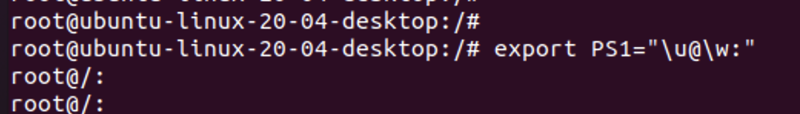
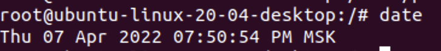
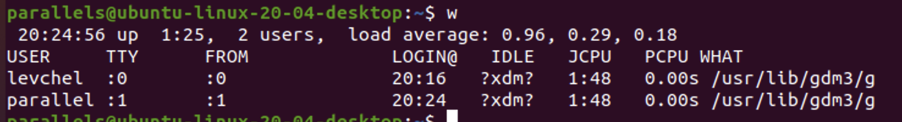
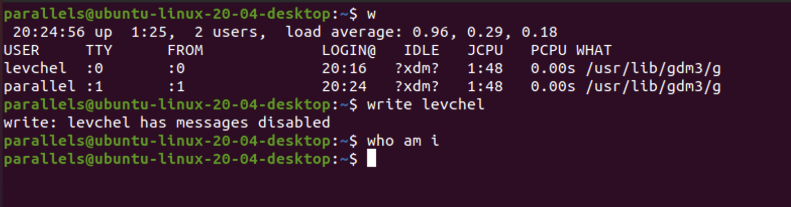
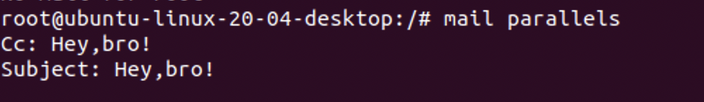
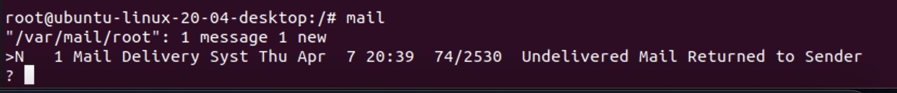

# Лабораторная работа №1
## Проценко Анастасия


* Cодержание системного файла ```cat/etc/passwd```

```bash
parallels@ubuntu-linux-20-04-desktop:~$ cat /etc/passwd
root:x:0:0:root:/root:/bin/bash
daemon:x:1:1:daemon:/usr/sbin:/usr/sbin/nologin
bin:x:2:2:bin:/bin:/usr/sbin/nologin
sys:x:3:3:sys:/dev:/usr/sbin/nologin
sync:x:4:65534:sync:/bin:/bin/sync
games:x:5:60:games:/usr/games:/usr/sbin/nologin
man:x:6:12:man:/var/cache/man:/usr/sbin/nologin
lp:x:7:7:lp:/var/spool/lpd:/usr/sbin/nologin
mail:x:8:8:mail:/var/mail:/usr/sbin/nologin
news:x:9:9:news:/var/spool/news:/usr/sbin/nologin
uucp:x:10:10:uucp:/var/spool/uucp:/usr/sbin/nologin
proxy:x:13:13:proxy:/bin:/usr/sbin/nologin
www-data:x:33:33:www-data:/var/www:/usr/sbin/nologin
backup:x:34:34:backup:/var/backups:/usr/sbin/nologin
list:x:38:38:Mailing List Manager:/var/list:/usr/sbin/nologin
irc:x:39:39:ircd:/var/run/ircd:/usr/sbin/nologin
gnats:x:41:41:Gnats Bug-Reporting System (admin):/var/lib/gnats:/usr/sbin/nologin
nobody:x:65534:65534:nobody:/nonexistent:/usr/sbin/nologin
systemd-network:x:100:102:systemd Network Management,,,:/run/systemd:/usr/sbin/nologin
systemd-resolve:x:101:103:systemd Resolver,,,:/run/systemd:/usr/sbin/nologin
systemd-timesync:x:102:104:systemd Time Synchronization,,,:/run/systemd:/usr/sbin/nologin
messagebus:x:103:106::/nonexistent:/usr/sbin/nologin
syslog:x:104:110::/home/syslog:/usr/sbin/nologin
_apt:x:105:65534::/nonexistent:/usr/sbin/nologin
tss:x:106:111:TPM software stack,,,:/var/lib/tpm:/bin/false
uuidd:x:107:112::/run/uuidd:/usr/sbin/nologin
tcpdump:x:108:113::/nonexistent:/usr/sbin/nologin
landscape:x:109:115::/var/lib/landscape:/usr/sbin/nologin
pollinate:x:110:1::/var/cache/pollinate:/bin/false
systemd-coredump:x:999:999:systemd Core Dumper:/:/usr/sbin/nologin
parallels:x:1000:1000:Parallels:/home/parallels:/bin/bash
lxd:x:998:100::/var/snap/lxd/common/lxd:/bin/false
rtkit:x:111:119:RealtimeKit,,,:/proc:/usr/sbin/nologin
dnsmasq:x:112:65534:dnsmasq,,,:/var/lib/misc:/usr/sbin/nologin
avahi-autoipd:x:113:121:Avahi autoip daemon,,,:/var/lib/avahi-autoipd:/usr/sbin/nologin
usbmux:x:114:46:usbmux daemon,,,:/var/lib/usbmux:/usr/sbin/nologin
avahi:x:115:122:Avahi mDNS daemon,,,:/var/run/avahi-daemon:/usr/sbin/nologin
cups-pk-helper:x:116:123:user for cups-pk-helper service,,,:/home/cups-pk-helper:/usr/sbin/nologin
speech-dispatcher:x:117:29:Speech Dispatcher,,,:/run/speech-dispatcher:/bin/false
kernoops:x:118:65534:Kernel Oops Tracking Daemon,,,:/:/usr/sbin/nologin
saned:x:119:125::/var/lib/saned:/usr/sbin/nologin
nm-openvpn:x:120:126:NetworkManager OpenVPN,,,:/var/lib/openvpn/chroot:/usr/sbin/nologin
hplip:x:121:7:HPLIP system user,,,:/run/hplip:/bin/false
whoopsie:x:122:127::/nonexistent:/bin/false
colord:x:123:128:colord colour management daemon,,,:/var/lib/colord:/usr/sbin/nologin
geoclue:x:124:129::/var/lib/geoclue:/usr/sbin/nologin
pulse:x:125:130:PulseAudio daemon,,,:/var/run/pulse:/usr/sbin/nologin
gnome-initial-setup:x:126:65534::/run/gnome-initial-setup/:/bin/false
gdm:x:127:132:Gnome Display Manager:/var/lib/gdm3:/bin/false
levchel:x:1001:1001:levchel,,,:/home/levchel:/bin/bash
```

Для просмотра переменных окружения можно воспользоваться командой ```exporter``` или ```env```

```bash
root@ubuntu-linux-20-04-desktop:/# export
declare -x COLORTERM="truecolor"
declare -x DISPLAY=":0"
declare -x HOME="/root"
declare -x LANG="en_US.UTF-8"
declare -x LESSCLOSE="/usr/bin/lesspipe %s %s"
declare -x LESSOPEN="| /usr/bin/lesspipe %s"
declare -x LOGNAME="root"
declare -x LS_COLORS="rs=0:di=01;34:ln=01;36:mh=00:pi=40;33:so=01;35:do=01;35:bd=40;33;01:cd=40;33;01:or=40;31;01:mi=00:su=37;41:sg=30;43:ca=30;41:tw=30;42:ow=34;42:st=37;44:ex=01;32:*.tar=01;31:*.tgz=01;31:*.arc=01;31:*.arj=01;31:*.taz=01;31:*.lha=01;31:*.lz4=01;31:*.lzh=01;31:*.lzma=01;31:*.tlz=01;31:*.txz=01;31:*.tzo=01;31:*.t7z=01;31:*.zip=01;31:*.z=01;31:*.dz=01;31:*.gz=01;31:*.lrz=01;31:*.lz=01;31:*.lzo=01;31:*.xz=01;31:*.zst=01;31:*.tzst=01;31:*.bz2=01;31:*.bz=01;31:*.tbz=01;31:*.tbz2=01;31:*.tz=01;31:*.deb=01;31:*.rpm=01;31:*.jar=01;31:*.war=01;31:*.ear=01;31:*.sar=01;31:*.rar=01;31:*.alz=01;31:*.ace=01;31:*.zoo=01;31:*.cpio=01;31:*.7z=01;31:*.rz=01;31:*.cab=01;31:*.wim=01;31:*.swm=01;31:*.dwm=01;31:*.esd=01;31:*.jpg=01;35:*.jpeg=01;35:*.mjpg=01;35:*.mjpeg=01;35:*.gif=01;35:*.bmp=01;35:*.pbm=01;35:*.pgm=01;35:*.ppm=01;35:*.tga=01;35:*.xbm=01;35:*.xpm=01;35:*.tif=01;35:*.tiff=01;35:*.png=01;35:*.svg=01;35:*.svgz=01;35:*.mng=01;35:*.pcx=01;35:*.mov=01;35:*.mpg=01;35:*.mpeg=01;35:*.m2v=01;35:*.mkv=01;35:*.webm=01;35:*.ogm=01;35:*.mp4=01;35:*.m4v=01;35:*.mp4v=01;35:*.vob=01;35:*.qt=01;35:*.nuv=01;35:*.wmv=01;35:*.asf=01;35:*.rm=01;35:*.rmvb=01;35:*.flc=01;35:*.avi=01;35:*.fli=01;35:*.flv=01;35:*.gl=01;35:*.dl=01;35:*.xcf=01;35:*.xwd=01;35:*.yuv=01;35:*.cgm=01;35:*.emf=01;35:*.ogv=01;35:*.ogx=01;35:*.aac=00;36:*.au=00;36:*.flac=00;36:*.m4a=00;36:*.mid=00;36:*.midi=00;36:*.mka=00;36:*.mp3=00;36:*.mpc=00;36:*.ogg=00;36:*.ra=00;36:*.wav=00;36:*.oga=00;36:*.opus=00;36:*.spx=00;36:*.xspf=00;36:"
declare -x MAIL="/var/mail/root"
declare -x OLDPWD="/home/parallels"
declare -x PATH="/usr/local/sbin:/usr/local/bin:/usr/sbin:/usr/bin:/sbin:/bin:/usr/games:/usr/local/games:/snap/bin"
declare -x PWD="/"
declare -x SHELL="/bin/bash"
declare -x SHLVL="1"
declare -x SUDO_COMMAND="/usr/bin/su"
declare -x SUDO_GID="1000"
declare -x SUDO_UID="1000"
declare -x SUDO_USER="parallels"
declare -x TERM="xterm-256color"
declare -x USER="root"
declare -x XAUTHORITY="/run/user/1000/gdm/Xauthority"
```

* Формат строки приглашения задается в переменной окружения PS1. Чтобы настроить приглашение, необходимо изменить значение переменной PS1.
Для данной сессии можно установить переменную с помощью команды:
```bash
export PS1="\u@\w:"
```
На скриншоте видно, как поменялась строка приглашение в терминале


---

* На скриншоте вывела текущую дату и время


Есть 2 юзера ***parallels*** и ***levchel***


 
 Одновременно подключиться не дает возможности, как только меняются юзеры:

 

* Выполнила команды:

```bash
sudo apt install mailutils
```
после обновить конфигурацию почтового сервера

```bash
systemctl reload postfix
```
* Отправляем сообщение

 

* Видим его
 
